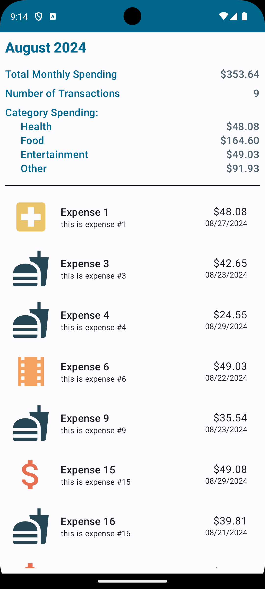
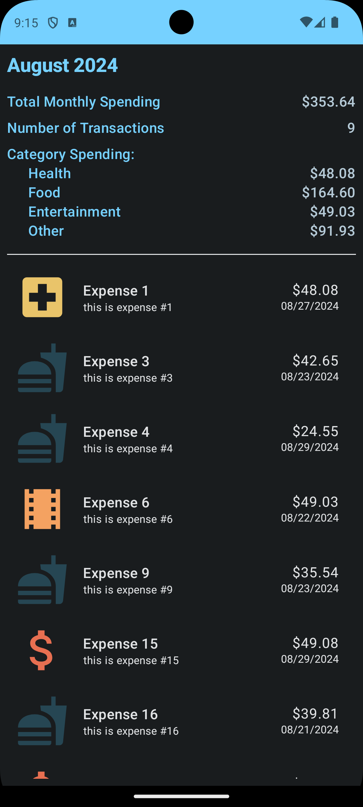

# ExpenseTracker

ExpenseTracker is a simple Android application built with **Kotlin** and **Jetpack Compose**. The app helps users track their monthly expenses, categorize them, and view summaries of their spending. The app uses a **ViewModel** to manage expenses and currencies. 

### Current Functionality:
- Displays a list of **generated expenses** for the month of **August** as placeholder data. This will be replaced by real user input and data storage in future updates.

## Technologies Used

- **Kotlin**: Primary language for Android development.
- **Jetpack Compose**: Modern Android UI toolkit for building declarative UIs.
- **ViewModel**: Part of Android's Architecture Components, used for managing UI-related data in a lifecycle-conscious way.
- **Material3**: Google’s Material Design 3 components for modern and sleek UI.

## Future Enhancements

- **Add and Delete Features**: Allow users to add and delete their own expenses.
- **Room Database Integration**: To persist expenses and currencies locally for offline access.
- **Firebase Integration**: For syncing data across devices and cloud-based storage, enabling data backup and synchronization.
- **Graphs and Charts**: To visualize spending trends and provide more insights into user expenses with visual aids.

## Screenshots

  
  

